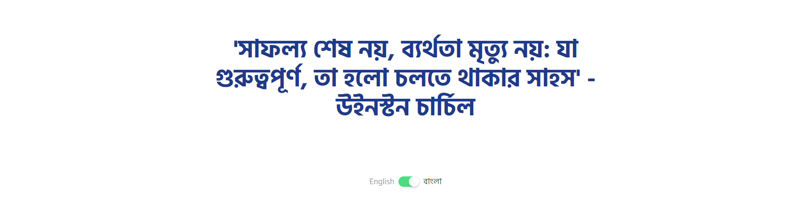
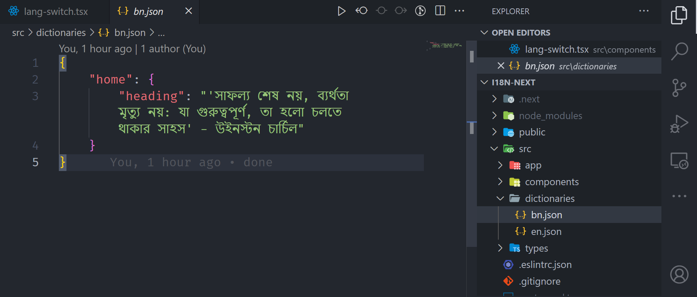
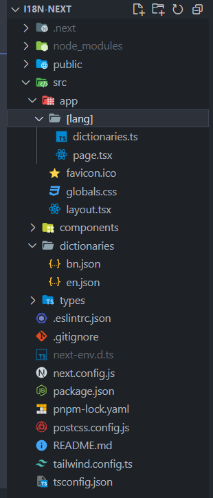

# **Internationalization**





When It comes to the matter of multilingual then NextJS brings Internationalization for us. Today we will implement that easy step by step.

### **Dictionaries**

Let's create dictionaries for our all of the contents. In my case, I am creating for two different languages as you can see in above picture.

Here are my two dictionaries like this



```json filename="src/dictionaries/bn.json" copy
{
    "home": {
        "heading": "'সাফল্য শেষ নয়, ব্যর্থতা মৃত্যু নয়: যা গুরুত্বপূর্ণ,
         তা হলো চলতে থাকার সাহস' - উইনস্টন চার্চিল"
    }
}
```

```json filename="src/dictionaries/en.json" copy
{
    "home": {
        "heading": "'Success is not final, failure is not fatal:
         It is the courage to continue that counts' - Winston Churchill"
    }
}
```

### **Creating dictionaries.ts**

Create dictionaries.ts like this inside you project and also get all the pages inside the same directory as they will be multilingual



```ts filename="src/app/[lang]/dictionaries.ts" copy
import "server-only";

const dictionaries: Record<string, () => Promise<any>> = {
  en: () => import("@/dictionaries/en.json").then((module) => module.default),
  bn: () => import("@/dictionaries/bn.json").then((module) => module.default),
};

export const getDictionary = async (locale: string) => {
  const dictionaryFn = dictionaries[`${locale ? locale : "en"}`];
  try {
    return await dictionaryFn();
  } catch (error) {
    throw new Error(
      `Error while loading dictionary for locale 'sw.js' not found!`
    );
  }
};
```

### **Make changes in main layout.tsx**

Here I have put the font and also made some changes to the metadata

```tsx filename="src/app/layout.tsx" copy
import "./globals.css";
import type { Metadata } from "next";
import { Hind_Siliguri } from "next/font/google";

const hindSiliguri = Hind_Siliguri({
  subsets: ["latin"],
  weight: ["300", "400", "500", "600", "700"],
});

export const metadata: Metadata = {
  title: "i18n",
  description: "Multi Lingual Site using NEXTJS",
};

export default function RootLayout({
  children,
}: {
  children: React.ReactNode;
}) {
  return (
    <html lang="en">
      <body className={hindSiliguri.className}>{children}</body>
    </html>
  );
}
```

### **Creating type.ts**

Create a type.ts in types folder in the root directory

```ts filename="src/types/types.ts" copy
export type ParamLang = { params: { lang: string } };
```

### **Language switch**

Add language switcher component to your components folder

```tsx filename="/src/components/lang-switch.tsx" copy
import { ParamLang } from "@/types/types";
import Link from "next/link";

const LangSwitch = ({ params }: ParamLang) => {
  const langToSwitch = params.lang === "en" ? "bn" : "en";
  return (
    <Link href={`/${langToSwitch}`}>
      {params.lang ? (
        <div className="flex items-center justify-center gap-2">
          <div
            className={`${
              params.lang === "en" ? "text-blue-900" : "text-gray-400"
            }`}
          >
            English
          </div>
          <div
            className={`w-10 h-5 rounded-full relative shadow ${
              params.lang === "en" ? "bg-blue-900" : "bg-green-400"
            }`}
          >
            <div
              className={`absolute top-0 left-0 w-5 h-5 rounded-full bg-white
               shadow-md transition ease-in-out ${
                 params.lang === "en" ? "translate-x-0" : "translate-x-[100%]"
               }`}
            ></div>
          </div>
          <div
            className={`${
              params.lang === "bn" ? "text-green-900" : "text-gray-400"
            }`}
          >
            বাংলা
          </div>
        </div>
      ) : (
        "Switch"
      )}
    </Link>
  );
};

export default LangSwitch;
```

### **Page that will use multilingual text content**

```tsx filename="src/app/[lang]/page.tsx" copy
import { getDictionary } from "@/app/[lang]/dictionaries";
import LangSwitch from "@/components/lang-switch";
import { ParamLang } from "@/types/types";

export default async function Home({ params }: ParamLang) {
  const dictionary = await getDictionary(params.lang);
  return (
    <main className="flex min-h-screen flex-col items-center justify-between p-3 md:p-24">
      <h1 className="text-5xl font-extrabold text-blue-900 max-w-[800px] leading-[3.5rem] text-center">
        {dictionary.home.heading}
      </h1>
      <LangSwitch params={params} />
    </main>
  );
}
```

### **Demo and source code**

[Visit Demo](https://i18n-next-sigma.vercel.app/bn) | 
[Source Code](https://github.com/musiur/i18n-next)
